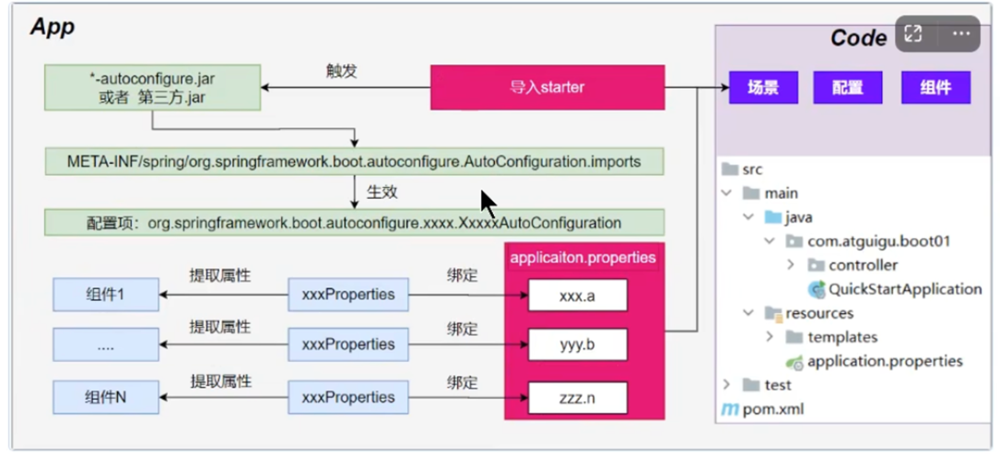

自動配置的原理
1. 導入 starter-web：導入了 web 開發場景。
   (1) 場景啟動器導入了相關場景的所有依賴： starter-json、starter-tomcat、springmvc
   (2) 每個場景啟動器都引用了一個 spring-boot-start，核心場景啟動器。
   (3) 核心場景啟動器，引入了 spring-boot-autoconfigure 包。
   (4) spring-boot-autoconfigure 裡面囊括了所有場景的所有配置。
   (5) 只要這個包下的所有類都能生效，那麼相當於 SpringBoot 官方寫好的整合功能就生效了。
   (6) SpringBoot 默認掃描不到 spring-boot-autoconfigure 下寫好的所有配置類。（因為這些配置類給我們做了整合操作），默認只掃描主程序所在的包。

2. 主程式：@SpringBootApplication。
   (1) @SpringBootApplication 由三個註解組成：@SpringBootConfiguration @EnableAutoConfiguration @ComponentScan。
   (2) SpringBoot 默認只能掃描自己主程式所在的包及其下面的子包，掃描不到 spring-boot-autoconfigure 包中的官方寫好的配置類。
   (3) @EnableAutoConfiguration：SpringBoot 開啟自動配置的核心。
       -> 是由 @Import(AutoConfigurationImportSelector.class) 提供功能：給容器中批量導入組件。
       -> SpringBoot 啟動會默認加載 142 個配置類。
       -> 這 142 個配置類來自於 spring-boot-autoconfigure 下 META-INF/spring/org.springframework.boot.autoconfigure.AutoConfiguration.imports 文件指定的。
       -> 項目啟動的時候利用 @Import 批量導入的組件機制把 autoconfigure 包下的 142 的 'xxxxxxAutoConfiguration' 類導入進來（自動配置類）。
       -> 按需生效：
          * 並不是這 142 個自動配置類都能生效。
          * 每一個自動配置類，都有條件註解 '@ConditionalOnxxxxxx'，只有條件成立，才能生效。

3. xxxAutoConfiguration 自動配置類
   (1) 給容器中使用 @Bean 放一堆組件。
   (2) 每個自動配置類都可能有這個註解 @EnableConfigurationProperties(ServerProperties.class)，用來把配置文件中配的指定前綴的屬性值封裝到 xxxProperties 屬性中。
   (3) 以 Tomcat 為例：把服務器中的所有配置都是以 server 開頭的。配置都封裝到屬性類中。
   (4) 給容器中放的所有組件的一些核心參數，都來自於 xxxProperties。xxxProperties 都是和配置文件綁定。
       * 只需要改配置文件的值，核心組件的參數都能修改。

4. 寫業務，全程不需要關心各種整合。（底層這些都寫好了，而且也生效了）

* 核心流程
  (1) 導入 starter，就會導入 autoconfigre 包。
  (2) autoconfigure 包裡面有的一個文件：META-INF/spring/org.springframework.boot.autoconfigure.AutoConfiguration.imports，裡面指定了所有要加載的自動配置類。
  (3) @EnableAutoConfiguration 會自動的把上面的文件裡面寫的所有配置類都導入進來。
      -> xxxAutoConfiguration 是有條件註解進行按需加載。
  (4) xxxAutoConfiguration 會給容器中導入一堆組件，組件都是以 xxxProperties 中提取屬性值。
  (5) xxxProperties 又是和配置文件進行綁定。

* 效果：導入 starter，修改配置文件，就能修改底層行為。

